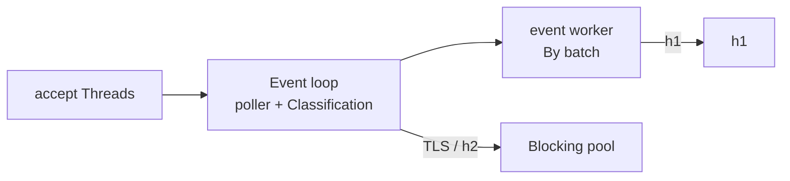

# courierust_server

The HTTP server, and the home of the event-driven scheduler. By default, idle / partial / slow connections park on a readiness poller and consume **zero workers**; ready ones are dispatched to event workers in batches. TLS and HTTP/2 connections run on the blocking work-stealing pool. `ServerConfig::event_driven` defaults to `true`.

## The architecture



- **Accept thread** only accepts — it never reads, peeks, sleeps, or classifies, so a slow client can never stall the accept path.
- **Event loop** parks plain-HTTP connections on the poller (Winsock `select` / POSIX `poll`), classifies TLS / h2 / h1 from the first bytes, and reaps idle connections.
- **Event workers** run an incremental request parser that resumes where it left off, so a partial request is parked again, not held.
- **TLS and HTTP/2** go to the blocking pool, bounded by `handshake_timeout` / `h2_idle_timeout` / worker count.

The whole thing is held together by a **self-pipe** — a loopback socket pair whose read end is registered in the poller, so a queued control message interrupts a blocking poll *the instant* it's queued. Poll timeout never sits in the request-latency path. The full story, with the 5 ms P99 spike that motivated it, is in `blogs/03-self-pipe-event-scheduler.md`.

## The close-ordering invariant (why one connection ending cannot park the rest)

A closed descriptor sitting in a wait set is not a harmless stale entry: POSIX `poll` reports `POLLNVAL` for that one entry, but Winsock's `select` fails the **whole** wait with `WSAENOTSOCK`. So:

- When a connection ends, the worker hands its socket handle to the event loop (`EventMsg::Closed { id, socket }`). The event loop unregisters the id from the poller **first** and drops the handle **after** — the descriptor is still open for as long as it can be named, so *"stop watching" strictly precedes "close"*.
- Every close that happens inside the event loop itself (idle reap, failed classification, dropped dispatch) unregisters before it closes, in the same order.
- A wait can still fail (a reused descriptor, a close from elsewhere). The event loop then **rebuilds** the whole wait set from its registries (`pending` / h1 / WebSocket), which drops whatever no longer exists, and backs off instead of spinning if the rebuilt set still cannot be waited on. Recoveries are counted in `Stats::event_wait_errors`; a healthy run leaves it at zero.

## The protection, before workers are involved

- An incomplete request parks on the poller (zero workers).
- A streaming response body parks between chunks too: the worker returns as soon as the producer stops feeding it, and the producer's own `send` wakes the reactor (a raw `Body::Channel` without that wake handle is polled instead). Waiting for the next chunk no longer holds a worker.
- Streaming responses to a `Connection: close` request are written in full before the connection closes.
- Connections idle for `idle_timeout` are reaped.
- `max_connections` caps the parked population outright.
- A herd of keep-alive / SSE / slow-loris connections cannot consume the pool — the concurrency benchmark proves it: 200 idle half-open connections + 2 workers still serve a probe in ~300 µs, while the legacy one-pool-job-per-connection model blocks entirely.

## Scope notes

- The event path serves HTTP/1.1. TLS and h2 run on the blocking pool by design.
- `event_driven: false` restores the legacy model — one pool job per connection — for comparison and debugging. Not recommended for production: idle/slow herds will exhaust the pool.
- A long-blocking synchronous handler occupies a worker (event-driven or not) — any synchronous server's disease. Use channel bodies for streaming: waiting for a chunk parks the connection instead of the worker.
- Both h2c prior knowledge and `h2c` Upgrade are served.
- **Client certificates (mTLS)** — `TlsSettings::client_auth` takes a `ClientAuth` (client-auth roots + `required`/`optional`) and this server then asks every client to authenticate: the certificate is validated against those roots, the validity window and the `clientAuth` EKU, and possession is proven by `CertificateVerify`. A client that declines while authentication is required is answered with `certificate_required` (116). Two boundaries are enforced rather than documented away: a config that combines `client_auth` with TLS 1.2 is refused when the handshake is set up, and `client_auth` + `http3` is refused at startup — mTLS here is TLS 1.3 over TCP.

## Embedding: who owns the accept loop

Two entry points, one engine:

- `Server` binds — or adopts, via `Server::from_listener`, a listener you
  bound yourself (a process that drops privileges after binding, systemd
  socket activation, a port shared between services) — and runs the
  scheduler itself.
- `courierust_server::serve_connection(stream, handler, config)` drives
  **one** accepted connection: TLS handshake, ALPN, HTTP/1.1 / HTTP/2,
  WebSocket upgrades, tunnels. That is the shape a proxy needs — the
  socket (and its `peer_addr`) is yours before the engine sees it, so
  per-connection policy (address allow-lists, rate limits, your own
  accounting) stays yours, while the protocol work stays the engine's.
  The socket is configured exactly as `Server` would: `TCP_NODELAY`,
  `handshake_timeout` during the TLS handshake, then `read_timeout`.

Two boundaries worth knowing. `serve_connection` refuses a config with
`http3` set: QUIC belongs to the server's own UDP reactor, which only
`Server::serve*` owns, and quietly serving TCP only would be a half
service. And a TLS config with an empty identity is refused wherever a
server or a connection is created — at startup, not once per client.

## WebSocket upgrades

A handler owns WebSocket routes the same way it owns HTTP routes:
`Handler::websocket(&self, req) -> WsUpgradeReply` returns
`Accept(service)` for the paths it serves and `Pass` for everything else,
so plain HTTP and WebSockets share one port and one handler.

The upgrade happens **in place, on both drivers**:

- **Blocking driver** (`event_driven: false`) — `courierust_server::ws::serve_blocking`
  drives the connection with a blocking loop, arming the socket's read
  deadline only while it waits for the next frame (Windows charges for a
  deadline on every blocking operation, writes included).
- **Event driver** (the default) — the HTTP connection becomes a
  `WsEventConn` that stays in the reactor: frames are read only when the
  socket is readable and queued application sends are flushed only when it
  is writable, so an idle WebSocket costs **a poller slot, not a thread**.
  A service callback runs on an event worker; fan-out from another thread
  goes through `WsConn::sender()` (`WsSender`), which queues and nudges the
  reactor instead of blocking it.

`WsConfig` (origin policy, subprotocols, frame/message/fragment caps, the
bounded send queue, Ping/Pong keepalive, `trusted_proxies`) is shared by
both drivers, so a policy decision can never depend on which one is
active — and `tests/ws.rs` runs the same scenarios through both. See
[`courierust_ws`](../courierust_ws/README.md) for the engine itself and
its protocol-level guarantees.

## H1 per-request stage timing

`COURIERUST_H1_TRACE=1` turns on per-request segment timing, emitted as
`H1SEG|...` lines — a connection-setup line (`event=newconn|accept_us`) and
one line per served request batch with the full nine-stage decomposition
of a 1 KiB keep-alive request:

```text
accept_us    accept → registered with the poller            (connection setup)
fresh_wait_us registered → first worker pickup              (first request only)
handoff_us   release → next pickup (keep-alive round trip   = last_write_to_reregistered
             + poll_ready_to_worker_dispatch)
dispatch_us  worker pickup → first byte read
parse_us     first byte read → request complete
handler_us   headers complete → response ready
build_us     response → first write (serialization)
write_us     first write → all written
```

The output is deliberately raw `key=value` pairs so a benchmark or shell
can bucket them. On loopback the dominant terms are `handoff_us` and
`write_us` — the reactor round trip and the socket write — while
`parse_us` / `handler_us` are single-digit microseconds, which is exactly
the answer to "is the time in the parser or in the handoff". Everything
is gated behind the env var; with it unset the hot path pays no
`Instant::now()` at all.

## Usage

```rust,no_run
use courierust::courierust_body::Body;
use courierust::courierust_http::{Request, Response};
use courierust::courierust_server::{Server, ServerConfig};

# fn main() -> Result<(), Box<dyn std::error::Error>> {
let mut cfg = ServerConfig::default();
cfg.http2 = true; // h2c + h1.1 on the same port
let server = Server::bind_with_config("127.0.0.1:8080", cfg)?;

server.serve(|_req: Request<Body>| -> Response<Body> {
    Response::with_status(200.into())
})?;
# Ok(())
# }
```

Add `ServerConfig::tls` with an `Identity` + ALPN and the same server speaks HTTPS — see `examples/https.rs`.
